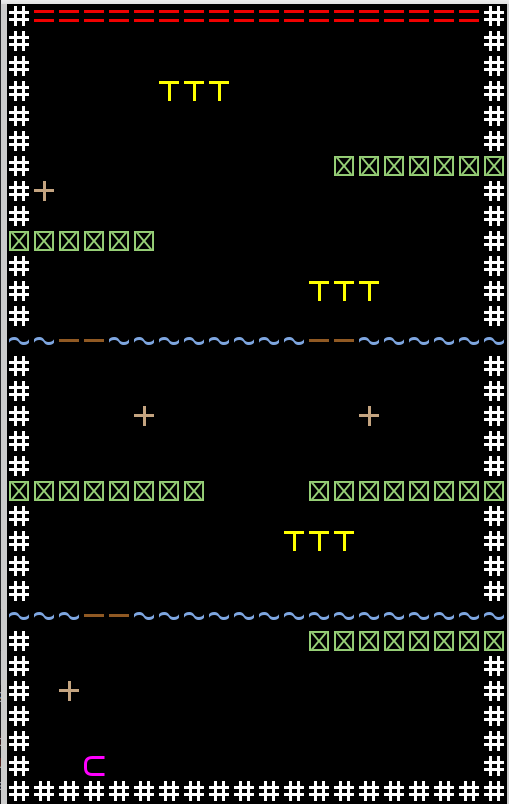
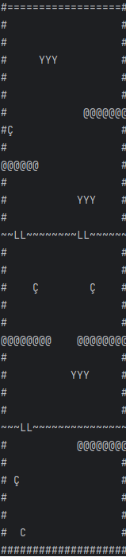

# Crossy Road (LDTS Project)

Crossy Road is a game where you control a chicken trying to cross busy roads and dangerous rivers.  
Timing, precision, and quick reactions are key to surviving traffic, avoiding water hazards, and reaching the goal.

This project was developed as part of the **LDTS 2025/26** course.

## Gameplay Highlights

- Simple and intuitive keyboard controls  
- Increasing difficulty with faster obstacles  
- Clear win/lose conditions  

## Screenshots

