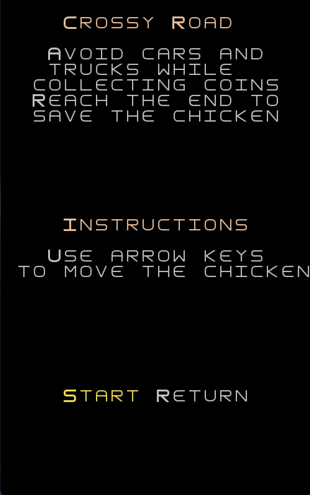
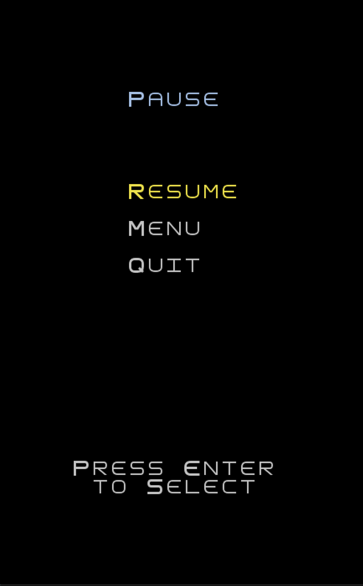

# Crossy Road (LDTS Project)

## Game Description

Crossy Road is a game where you control a chicken trying to cross busy roads and dangerous rivers.  
Timing, precision, and quick reactions are key to surviving traffic, avoiding water hazards, and reaching the goal.

This project was developed by Dário Amaral (up202405681@edu.fe.up.pt), David Ferreira (up202406798@edu.fe.up.pt) and Gonçalo Pinto (up202310411@edu.fe.up.pt) for LDTS 2025-26.

For a more detailed version of this description click [here](./docs/README.md).

## Gameplay Highlights

- Simple and intuitive keyboard controls  
- Increasing difficulty with faster obstacles  
- Clear win/lose conditions  

## Screenshots

    
    

        <i>Figure 1 - Main Menu</i>
    

    
    

        <i>Figure 2 - How To Play</i>
    

    
    

        <i>Figure 3 - Pause Menu</i>
    

    
    

        <i>Figure 4 - Game Over</i>
    

    
    

        <i>Figure 5 - Win Menu</i>
    

