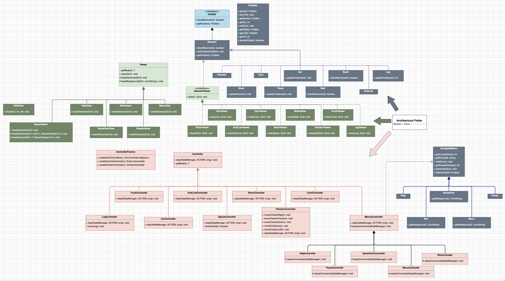
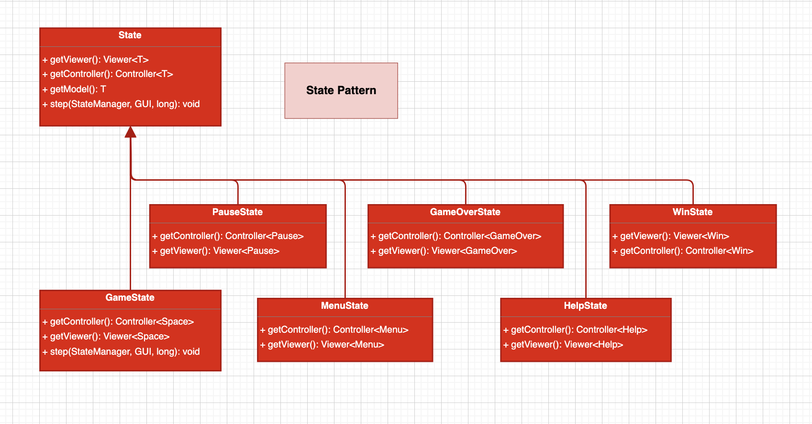
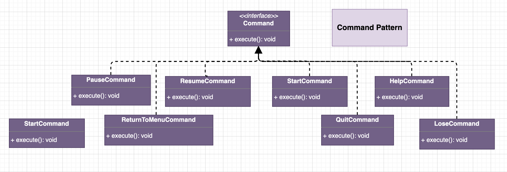
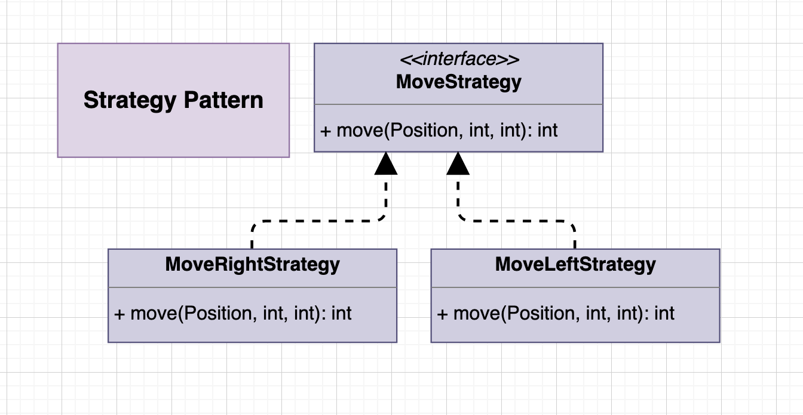
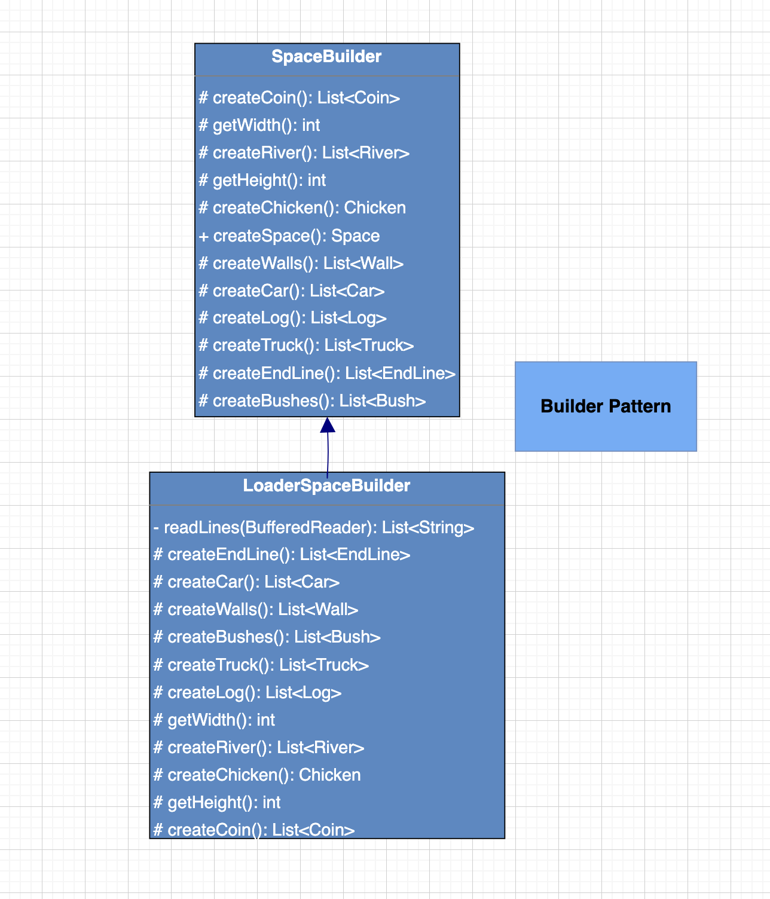
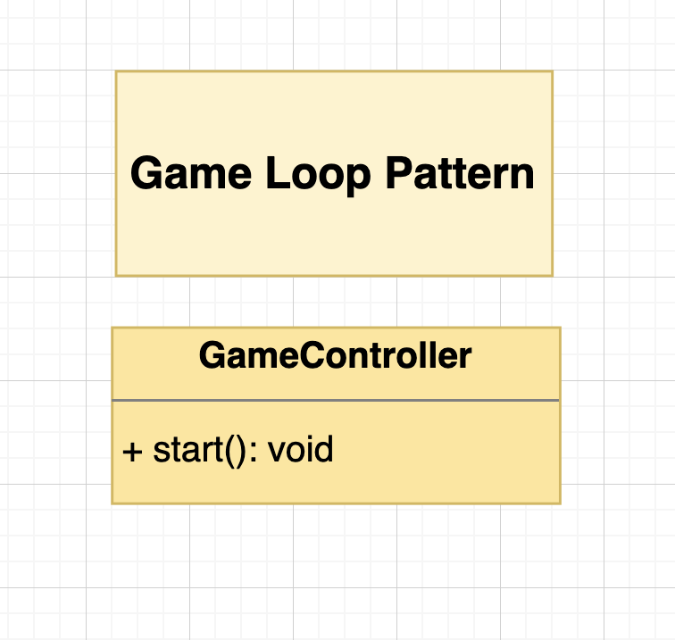
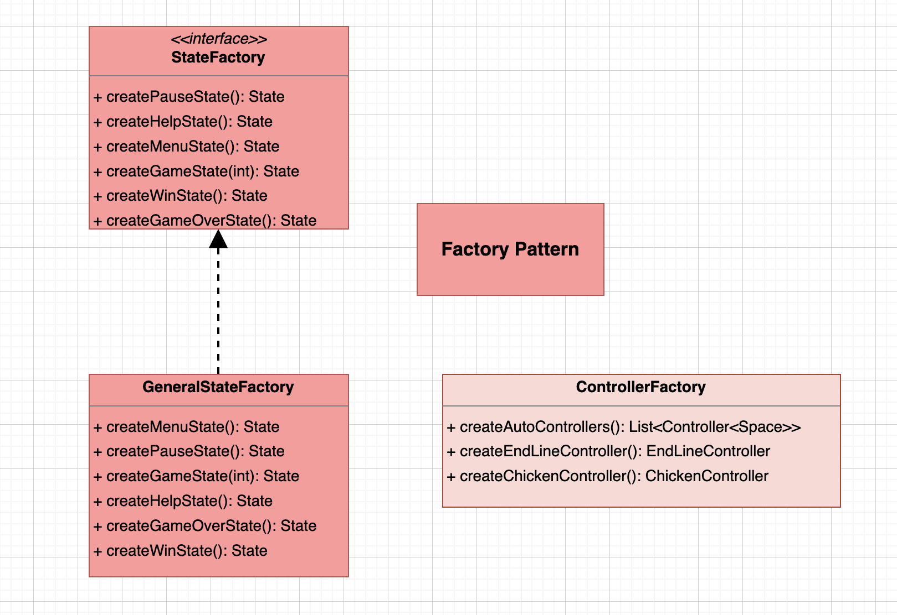
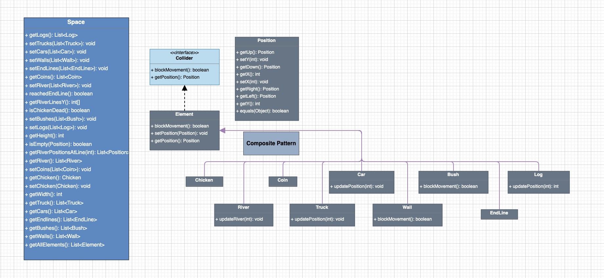
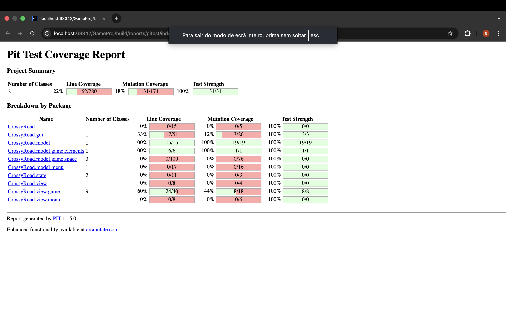

# LDTS_T04_G07 - Crossy Road
***

## Game Description

Crossy Road is a game where you control a chicken trying to cross busy roads, rivers, and bushes.
Each successful step brings the chicken closer to the final goal, testing your timing and reflexes at every turn.
The variety of levels will have increased difficulty, with faster vehicles, wider lakes, and trickier paths that require
strategy and precision.

>This project was developed by **Dário Amaral** (up202405681) ,**David Ferreira** (up202406798) and **Gonçalo Pinto** (up202310411) for LDTS 2025-26.

## Implemented Features

- **Character & Directional Movement**  
  Move the chicken in four directions (Up, Down, Left, and Right) with full control to navigate the game world.

- **Solid Boundaries**  
  Movement is constrained by the game window and static elements, preventing the player from leaving the playable area.

- **Dynamic Traffic**  
  Features two types of hazards: small, fast **Cars** for precise dodging, and longer, slower **Trucks** that act as persistent barriers.

- **Static Obstacles**  
  Fixed elements (**Bushes**) act as walls, creating strategic *bottlenecks* and limiting the player's path.

- **River Mechanics & Logs**  
  Rivers are lethal hazards unless the player jumps onto moving logs for safe passage.

- **Edge Lethality**  
  If the player remains on a log until it exits the map's boundaries, the game is lost.

- **Scoring System**  
  Collectible **Coins** are placed throughout the map, allowing players to increase their score as they progress.

- **Level Progression**  
  5 Levels with increasing difficulty, featuring faster vehicles and more frequent hazards as the player advances.

- **Collision Detection**  
  A precise system monitors overlaps with lethal elements (cars, trucks, or water), triggering a **Game Over** state.

- **State-Based Menus**  
  A complete UI system to navigate between **Main Menu**, **Help/Instructions**, **Pause**, **Victory**, and **Game Over** screens.

## Planned Features
***
All the planned features were successfully implemented.

## Design Patterns

Our architecture relies heavily on well-established software design patterns to ensure **modularity**, **maintainability**, and **scalability**. Below are the specific patterns applied, their location in the codebase, and the architectural problems they solved.

---

## 1. Model-View-Controller (MVC) — *Architectural Pattern*

**Context:**  
The core structure of the entire application.

**The Problem:**  
Initially, mixing game logic, data storage, and rendering in single classes (often referred to as a *God Class*) leads to spaghetti code. Changing the UI library (e.g., from **Lanterna** to **Swing**) would require rewriting the game logic, and testing the logic would be impossible without a graphical interface.

**The Solution:**  
We separated the code into three distinct layers:

- **Model**  
  Stores data and state (e.g., `Chicken`, `Space`, `Position`).

- **View**  
  Handles visual output (e.g., `ChickenViewer`, `GameViewer`).

- **Controller**  
  Processes input and updates models (e.g., `ChickenController`, `MenuController`).

**Benefit:**  
This separation allows us to test game logic (Models and Controllers) without initializing the GUI and makes the codebase easier to understand, maintain, and extend.

---

## 2. State Pattern

**Context:**  
Managing the different screens of the application (`StateManager`, `GameState`, `MenuState`).

**The Problem:**  
The game exhibits different behaviors depending on its current state (Menu, Playing, Pause, Game Over). Handling all these behaviors using large conditional statements inside the main game loop would violate the **Open-Closed Principle** and significantly reduce code readability.

**The Solution:**  
We implemented the **State Pattern**, delegating the game logic execution to the currently active state.

- **Implementation:**  
  An abstract `State` class defines a common interface, while concrete states such as `GameState` and `MenuState` implement state-specific behavior.

**Benefit:**  
New screens (for example, a *High Scores* screen) can be added by introducing a new state class, without modifying the existing game loop logic.

---

## 3. Command Pattern

**Context:**  
Decoupling GUI actions from application behavior (`Command` interface, `StartCommand`, `PauseCommand`, `ResumeCommand`).

**The Problem:**  
Coupling GUI events directly to application logic creates tight dependencies between the user interface and the game’s internal state management. For example, triggering a state change (such as starting a new game or pausing gameplay) directly from the GUI would make the UI layer responsible for business logic decisions, violating the **Single Responsibility Principle** and reducing flexibility.

**The Solution:**  
We applied the **Command Pattern** as an intermediate layer between **GUI Actions** and the **StateManager**.  
The GUI translates user interactions (such as key presses or menu selections) into **GUI actions**, which are then mapped to `Command` objects. Each command encapsulates a high-level intention (e.g., *initialize game*, *pause game*, *resume game*) and delegates execution to the appropriate system component, typically the `StateManager`.

**Benefit:**  
This approach clearly separates concerns:

- The **GUI** is responsible only for interpreting user interactions.
- **Commands** act as the connective layer that represents user intent.
- The **StateManager** executes application-level behavior, such as state transitions.

As a result, the system becomes easier to extend, test, and maintain. New actions or state transitions can be introduced by adding new commands without modifying existing GUI or state management logic.

---

## 4. Strategy Pattern

**Context:**  
Enemy and object movement `MoveStrategy`.

**The Problem:**  
Different game entities (Cars, Logs) require distinct movement behaviors. Using inheritance to model these differences would result in an excessive number of subclasses and a rigid class hierarchy.

**The Solution:**  
We defined a family of interchangeable movement algorithms using the **Strategy Pattern**. Each game object receives a `MoveStrategy` that determines its behavior at runtime.

**Benefit:**  
Movement logic can be changed dynamically (for example, from linear to zigzag motion) by swapping strategy objects, promoting **Composition over Inheritance**.

---

## 5. Builder Pattern

**Context:**  
Level construction (`SpaceBuilder`, `LoaderSpaceBuilder`).

**The Problem:**  
The `Space` object is complex, containing the player character, multiple collections of enemies and obstacles, and world boundaries. Creating such an object through a single constructor would lead to overly complex and error-prone initialization logic.

**The Solution:**  
We used the **Builder Pattern** to construct the `Space` object step by step. The `LoaderSpaceBuilder` reads level configuration files and invokes methods such as `createCars()`, `createLogs()`, and `createWalls()`.

**Benefit:**  
This separates the construction process from the final object representation, ensures that all `Space` instances are valid, and allows different level layouts to be created using the same construction process.

---

## 6. Game Loop Pattern

**Context:**  
Execution flow in the `GameController` class.

**The Problem:**  
If game updates are tied directly to processing speed, gameplay becomes inconsistent across different hardware, running too fast on powerful machines and too slow on weaker ones.

**The Solution:**  
We implemented a controlled **Game Loop Pattern** that updates the game state at a fixed rate (for example, 60 frames per second).

**Benefit:**  
This guarantees consistent gameplay timing and a smooth experience regardless of the player’s hardware.

---

## 7. Factory Pattern / Abstract Factory Pattern

**Context:**  
Creation of States and Controllers (`StateFactory`, `GeneralStateFactory`, `ControllerFactory`).

**The Problem:**  
Instantiating concrete states and controllers directly throughout the codebase leads to tight coupling and duplicated creation logic. It also makes it difficult to change or extend the set of available states or controllers without modifying multiple classes.

**The Solution:**  
We introduced factory classes responsible for object creation.  
The `StateFactory` (and its concrete implementation `GeneralStateFactory`) encapsulates the logic required to instantiate different `State` objects, while the `ControllerFactory` centralizes the creation of controllers.

**Benefit:**  
This approach decouples object creation from object usage, promotes consistency across the application, and simplifies the addition of new states or controllers without impacting existing code.

---

## 8. Adapter Pattern

**Context:**  
Integration of the graphical framework (`GUI` interface, `LanternaGUI` implementation).

**The Problem:**  
Directly coupling the game logic to a specific UI library would make the system rigid and hard to maintain. Switching from one graphical framework to another would require changes throughout the codebase.

**The Solution:**  
We defined a `GUI` interface representing the operations required by the application (drawing elements, reading actions, refreshing the screen).  
`LanternaGUI` acts as an **Adapter**, translating these generic GUI operations into calls to the Lanterna library.

**Benefit:**  
The application depends only on the `GUI` abstraction, not on a concrete UI framework. This enables easy replacement or extension of the graphical backend without modifying game logic, reinforcing the **Dependency Inversion Principle**.

---

## 9. Template Method Pattern

**Context:**  
Execution flow in abstract base classes (`State`, `Controller`).

**The Problem:**  
Different states and controllers follow similar execution flows but require customized behavior in specific steps. Duplicating this structure across subclasses would lead to code repetition and inconsistencies.

**The Solution:**  
Abstract base classes define the general algorithm structure, while allowing subclasses to implement specific steps.  
For example, the abstract `State` defines the overall execution contract, and concrete states implement state-specific logic.

**Benefit:**  
This pattern promotes code reuse, enforces consistent behavior across subclasses, and simplifies maintenance by centralizing shared logic in abstract base classes.

---

## 10. Application Controller Pattern *(Architectural Pattern)*

**Context:**  
Centralized management of application behavior (`StateManager`, Controllers).

**The Problem:**  
Allowing views or GUI components to control application flow directly would distribute business logic across multiple layers, making the system harder to reason about and maintain.

**The Solution:**  
We introduced controllers that act as intermediaries between user intentions (expressed through commands) and application behavior.  
The `StateManager` coordinates high-level actions such as state transitions, while controllers delegate these actions through well-defined commands.

**Benefit:**  
This results in a clear separation between presentation logic and application flow control, improving modularity, testability, and architectural clarity.

---

## 11. Composite Pattern 

**Context:**  
Game world composition (`Space`, `Element`, collections of elements).

**The Problem:**  
The game world is composed of multiple elements (cars, logs, bushes, coins) that must be treated uniformly during operations such as rendering and collision detection.

**The Solution:**  
We modelled all game objects as subclasses of a common `Element` abstraction and managed them collectively within the `Space` class.  
This allows the game engine to operate on individual elements and groups of elements in a uniform way.

**Benefit:**  
This design simplifies iteration over game objects and enables uniform handling of diverse elements. While not a strict Composite implementation, it exhibits key characteristics of the pattern and improves structural consistency.

## Known-code smells

Overuse of Inheritance:

    Smell: Deep inheritance hierarchies for game elements (e.g., Element → Obstacle → Car → Truck). 
    Why it’s a smell: Inheritance can reduce flexibility.
    Consequence: Harder to change behavior dynamically.
    Possible improvement: Prefer composition where possible (e.g., movement or collision components).

Duplicate Collision Logic:

    Smell: Similar collision checks repeated for cars, trucks, water, and logs.
    Why it’s a smell: Repeating everything.
    Consequence: Bug fixes must be applied in multiple places.
    Possible improvement: Centralize collision logic using a common interface or utility class.

Primitive Obsession: 

    Smell: Positions, dimensions, and speeds are represented using raw primitives (int x, int y).
    Why it’s a smell: Related data lacks semantic meaning and behavior.
    Consequence: Higher chance of bugs and duplicated logic.
    Possible improvement: Introduce small value objects like Position, Velocity, Bounds.

## Testing
***

### Test with Coverage 

<b><i>Fig 4. Coverage Testing </i></b>

  

  <b><i>Fig 5. Coverage Testing </i></b>

### Mutation testing

## Self-evaluation
***

The work was divided in a mutual way, and we all contributed with our best. It helped us to enrich our
java and principle/pattern knowledge, as well as our team work.

- Dário Amaral: 33.3%
- David Ferreira: 33.3%
- Gonçalo Pinto: 33.3%

